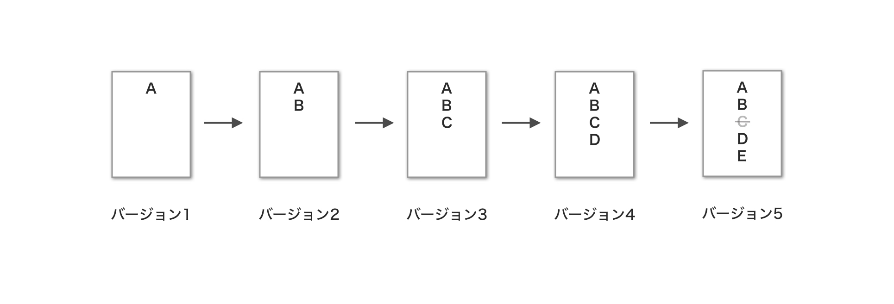
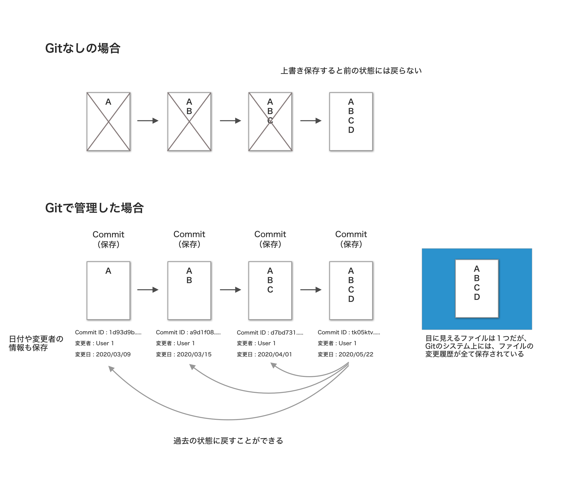

# Git

Gitは、プログラムのソースコードなどの変更履歴を記録・追跡するためのバージョン管理システムです。
<!-- （[Wikipedia](https://ja.wikipedia.org/wiki/Git）)） -->

この説明だけは理解しづらいと思うので、噛み砕いて説明します。

まず第一に、バージョン管理システムのバージョンとは何を差している言葉なのでしょうか？
バージョンとは、ファイルを変更して保存したそれぞれの地点のことです。

簡潔にいうと、ファイルの変更点などを、保存しておき、変更前の状態に戻せることを可能にするシステムです。

